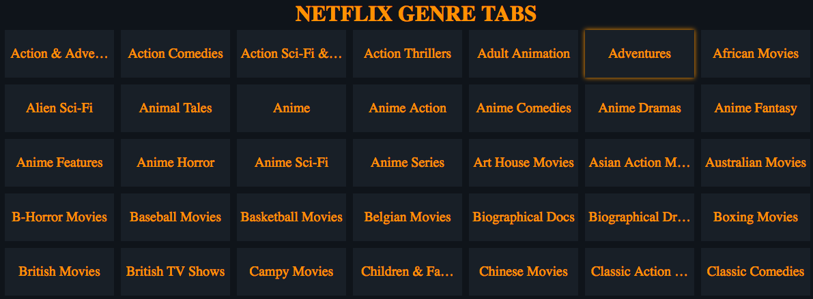

## NETFLIX GENRE TABS

[](https://www.devleague.com/)

* Search Netflix Movies via genre codes

# Demo UI Screenshot:


# Getting Started

```js
npm install 
npm start
```


This project was bootstrapped with [Create React App](https://github.com/facebookincubator/create-react-app).
